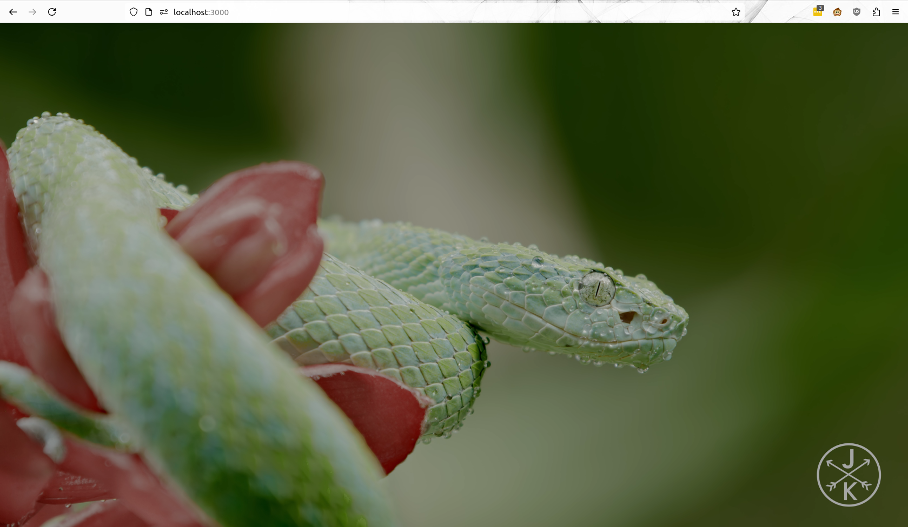
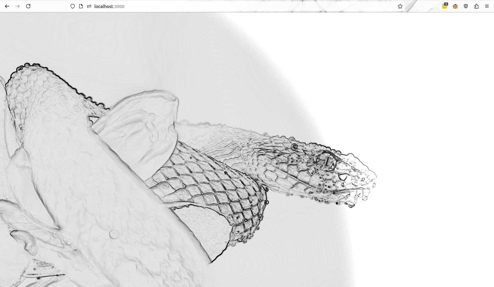

|             ORIGINAL             |          PROCESSED          |
| :------------------------------: | :-------------------------: |
|  |  |

ShadeFX is a UI Shade Composer allowing one to easily and intuitively build a post processing toolchain for videos and images for web browsers using WebGL and THREEJS.

Status: under development
