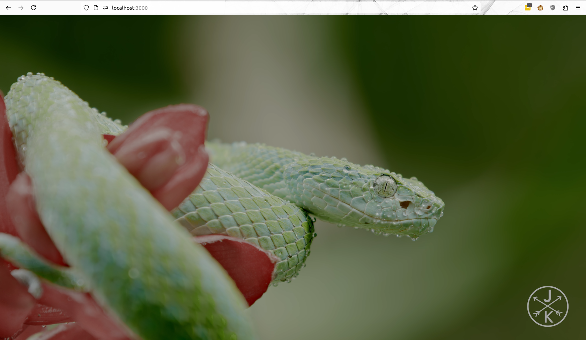

|               ORIGINAL               |            PROCESSED            |
| :----------------------------------: | :-----------------------------: |
|  |  |

ShadeFX is a UI Shader Composer allowing one to easily and intuitively build a post processing toolchain for videos and images using the web browser.
Powered by WebGL and THREEJS.

Status: under development
